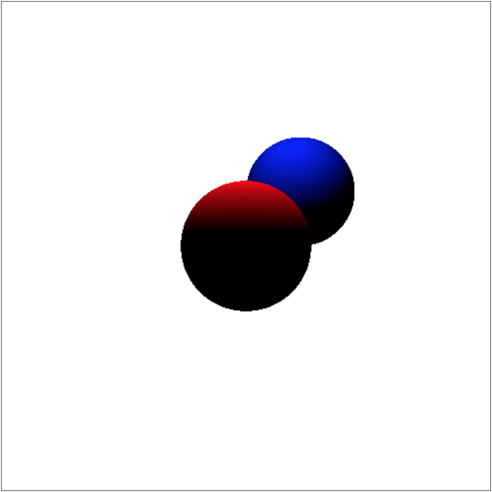
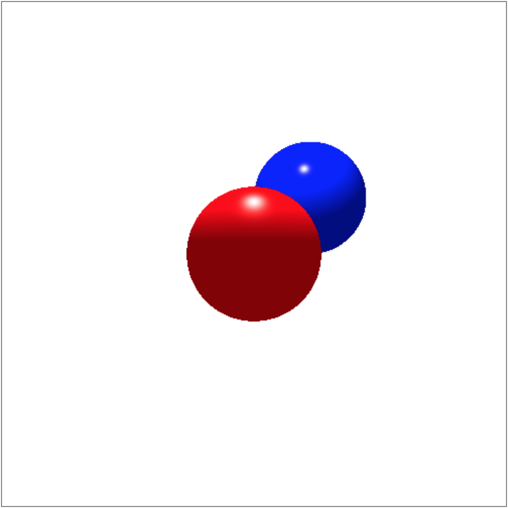
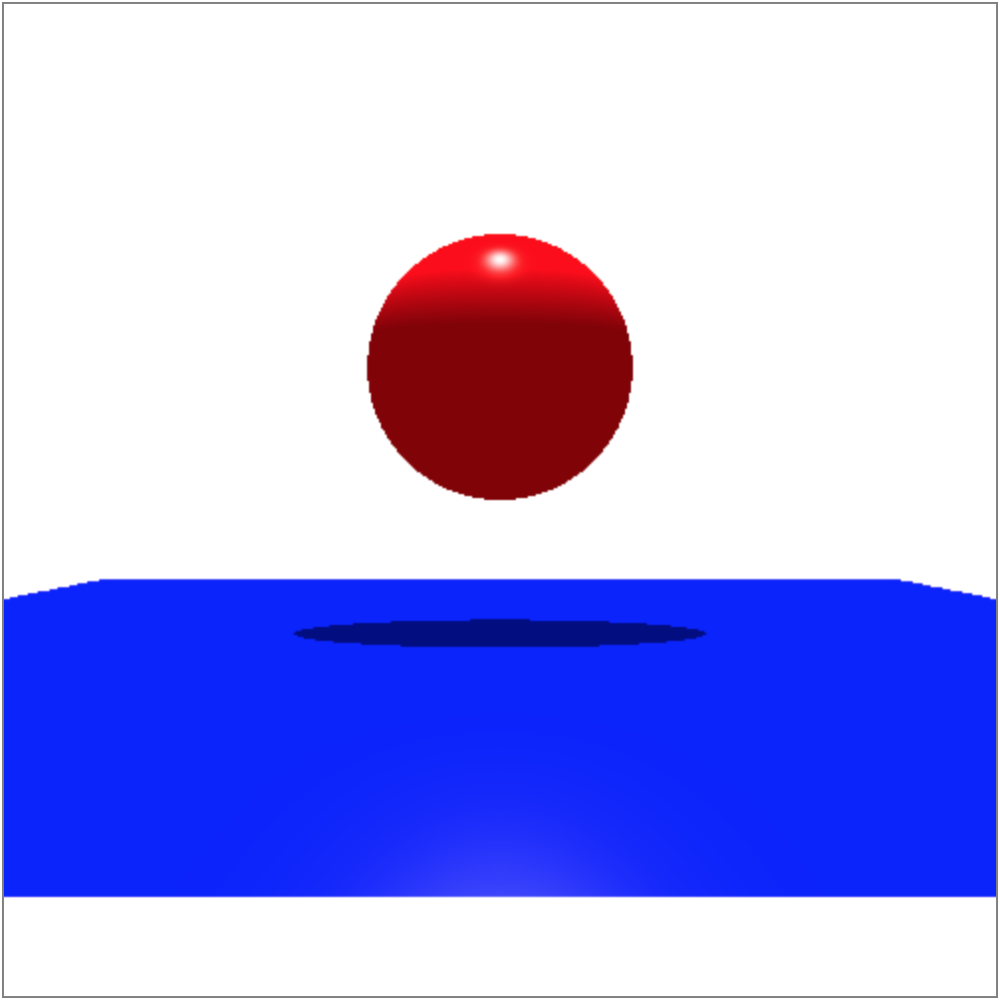

# Shading
Sample code for [ray tracing tutorial](https://github.com/sangwo/web-ray-tracer/blob/master/docs/04_shading.md#specular-phong).

Results:

## Diffuse only

## Ambient added

## Specular added

Notice the difference in highlights of the two spheres; the red sphere's shininess is set to 50 while the blue sphere's shininess is set to 200.

## Shadow

